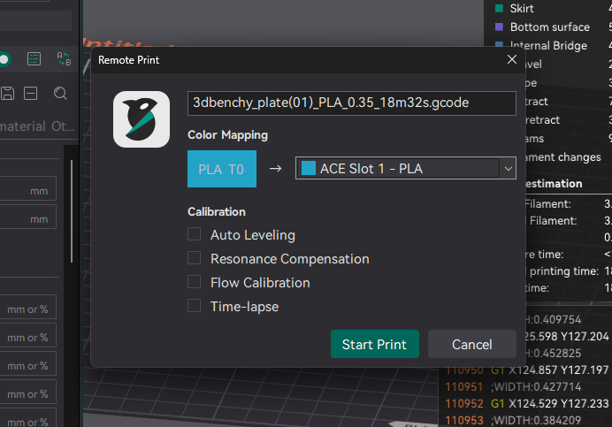
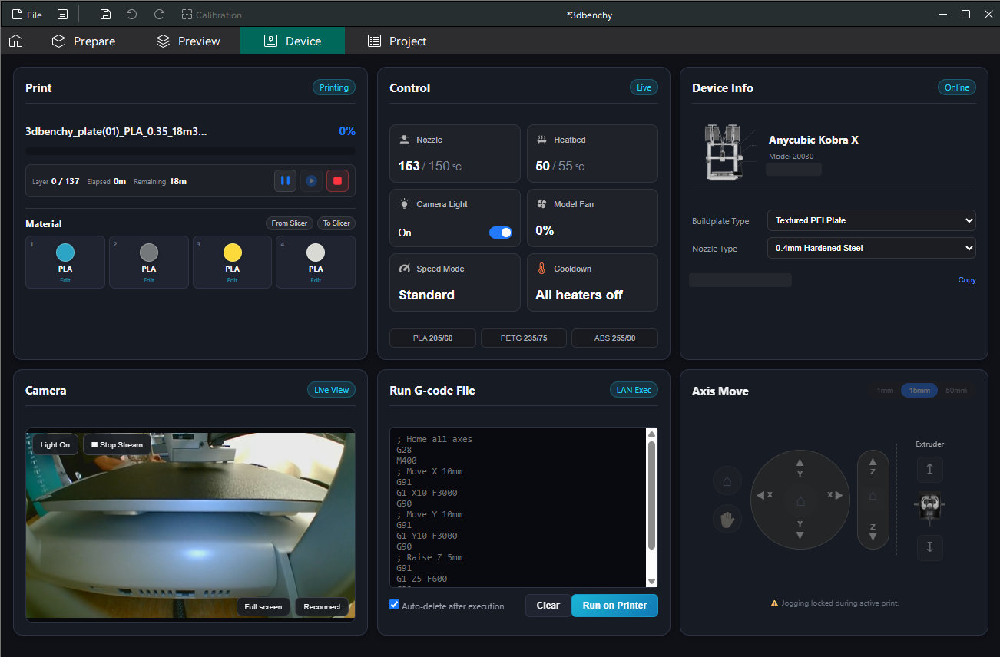
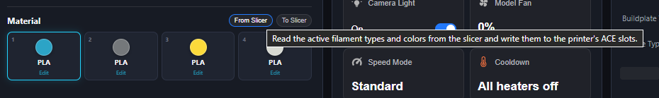
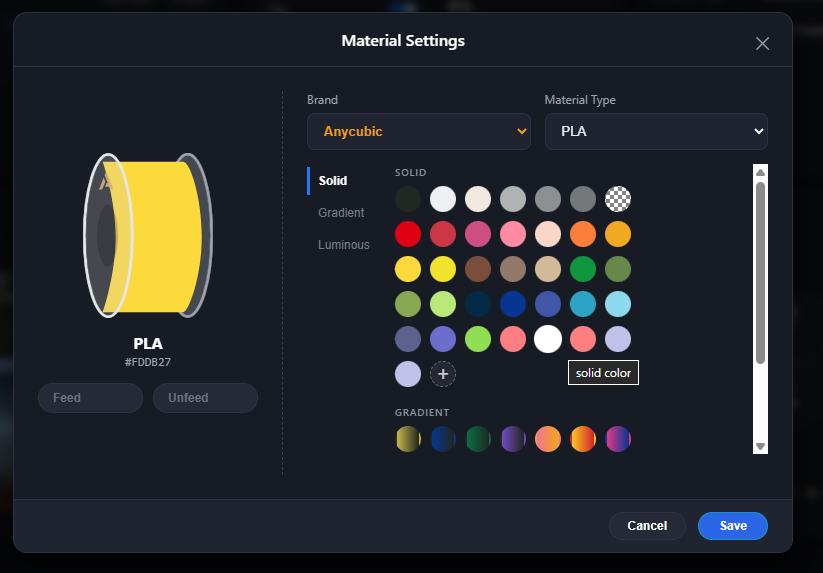

# OrcaCubic

**OrcaCubic is an experimental fork of [OrcaSlicer](https://github.com/OrcaSlicer/OrcaSlicer) for the Anycubic Kobra X, adding local network printing and support for its four-slot filament system.**

It combines OrcaSlicer's slicing workflow with selected printer-integration ideas from Anycubic Slicer Next and KX-Bridge. The goal is a single desktop application for slicing, material matching, LAN upload, print start, monitoring, and printer control.

> [!IMPORTANT]
> OrcaCubic has been tested on an **Anycubic Kobra X running firmware 2.0.1.9**. Other Anycubic models and firmware versions are not yet validated.

## Download

Download the current installer or portable build from [GitHub Releases](https://github.com/marcodiniz/OrcaCubic/releases/latest).

The release is currently unsigned. Windows may show a SmartScreen warning; verify the SHA-256 checksums published with the release before running it.

## What OrcaCubic adds

### Print directly to the Kobra X

- Connects to the printer over your local network.
- Sends sliced jobs directly from OrcaCubic.
- Lets you check and change which ACE slot will be used for each color before printing.
- Keeps the printer's connection information private on your computer.

### Remote Print material matching

Before a multi-material job starts, OrcaCubic shows the project tools and live printer slots so each sliced color can be assigned explicitly. It auto-suggests compatible slots by material and color, allows manual changes, and blocks invalid material mappings instead of silently choosing another slot.

### Local Device dashboard

The Device tab provides an Anycubic-style dashboard with:

- live print progress, layer, elapsed time, and remaining time;
- opt-in camera streaming and chamber/camera light controls;
- nozzle and bed temperatures, fan control, cooldown, and preheat presets;
- Quiet, Standard, Sport, and Ludicrous speed modes;
- pause, resume, and cancel controls;
- X/Y/Z movement, homing, motor release, extrusion, and retraction;
- a controlled **Run G-code File** workflow;
- device information and printer alerts;
- movement controls locked while a job is printing or paused.

### Filament synchronization and editor

- **From Slicer** sends the current OrcaCubic filament definitions and colors to the printer's four slots.
- **To Slicer** imports the printer's live slot materials and colors into the slicer.
- Solid, gradient, and luminous color definitions are supported.
- The material picker includes material, brand, finish, swatches, custom colors, and spool preview.
- Material cards update when a slot is changed directly on the printer.

#### Slicer-to-printer synchronization

#### Material settings

### Everyday safeguards

- Print upload and startup are handled in the background to prevent the crash seen in early builds.
- Private printer connection information is not shown in error messages or logs.
- The camera remains off until you select **Start Stream**.
- Movement and extrusion controls are disabled while a print is active or paused.
- Your selected color-to-slot assignments are preserved when the print starts.

## Setup

1. Put the Kobra X and the computer on the same trusted local network.
2. In OrcaCubic, select or create the **Anycubic Kobra X** printer profile.
3. Open **Printer settings → Physical printer**.
4. Choose **Anycubic** as the print host type and enter the printer's LAN IP address.
5. Use **Test** to verify the direct connection.
6. Slice a plate, select **Print**, review the material-to-ACE mappings, and start the job.

## Known limitations

- Hardware validation currently covers only Kobra X firmware `2.0.1.9`.
- The printer may still perform some preparation steps when a Remote Print calibration option is disabled because those steps are controlled by its firmware.
- Windows releases are not code-signed yet, so SmartScreen may display a warning.

## Future features

- **Flatpak package:** planned as a future Linux installation option after its application identity, sandbox permissions, and Kobra X connection workflow have been validated. See the [Flatpak validation checklist](docs/FUTURE_FLATPAK.md).
- **Anycubic Cloud printing:** investigated as a possible optional connection mode for printing outside the local network. It is not implemented or supported yet. See the [cloud-printing investigation and validation checklist](docs/FUTURE_ANYCUBIC_CLOUD_PRINTING.md).

## For contributors

See [BUILD_WIN.md](BUILD_WIN.md) to build OrcaCubic on Windows. Additional upstream build information is available in the [OrcaSlicer documentation](https://github.com/OrcaSlicer/OrcaSlicer/wiki/How-to-build).

## Thanks and upstream projects

OrcaCubic exists because of these projects and their contributors:

- [OrcaSlicer](https://github.com/OrcaSlicer/OrcaSlicer) — the upstream slicer and foundation of this fork.
- [AnycubicSlicerNext](https://github.com/ANYCUBIC-3D/AnycubicSlicerNext) — reference for Anycubic-oriented workflows, UI behavior, and printer integration.
- [KX-Bridge](https://gitea.it-drui.de/viewit/KX-Bridge-Release) — Kobra X LAN protocol research and bridge behavior that informed this integration.

Thank you to all maintainers, reverse engineers, testers, and contributors who made that work available.

## License

OrcaCubic follows OrcaSlicer's GNU Affero General Public License v3.0 terms. See [LICENSE.txt](LICENSE.txt) for details.

OrcaCubic is an independent community project. It is not affiliated with or endorsed by Anycubic or the OrcaSlicer maintainers.
